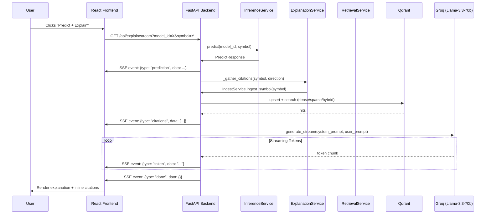

# Project Report

> **Equity Prediction + RAG Explanations**
> Auto-generated structural analysis enriched with narrative, diagrams, and measured behavior.
> ---
> **Date:** 2026-06-13
> **Primary Structural Source:** `graphify-out/GRAPH_REPORT.md`
> ---

## 1. Executive Summary

This project builds a production-ready forecasting and explanation engine for equity prices. It combines a comprehensive model zoo trained on S&P 500 and Nasdaq-100 constituents with a Retrieval-Augmented Generation (RAG) pipeline that grounds machine predictions in real-time financial news.

A user selects a model (from over 2,000 candidates), selects a ticker, and receives a predicted return (1-day or 5-day horizon) alongside a streamed narrative explaining *why* the model made that call, citing real news headlines. The backend serves predictions through a FastAPI layer while managing a vector store of ingested news, embeddings, and LLM-generated explanations via Groq.

**Confirmed.** See `backend/app/main.py`, `backend/app/model_registry.json`.

---

## 2. What We Built (Overview)

The system is a research-to-production pipeline:

1. **Data acquisition** — daily OHLCV and news for ~500 S&P 500 / 100 Nasdaq-100 names.
2. **Feature engineering** — canonical groups (G1–G5) spanning price, technicals, market breadth, and sentiment.
3. **Model training** — classical (ElasticNet, Ridge, HistGBR) and deep (LSTM, GRU, NHITS, TFT, Informer, PatchTST, Autoformer, MambaStock, NBEATS, FEDformer) across H1/H5 horizons.
4. **Model serving** — FastAPI backend loads models on demand via a registry, computes live features, and returns predictions.
5. **RAG explanation** — on demand, the backend retrieves relevant news from a hybrid (dense+sparse) Qdrant index, then streams a grounded explanation from Groq Llama-3.3-70b with inline citations.
6. **Frontend** — React 18 + Vite UI for model selection, ticker choosing, predictions, and streamed explanations.

```mermaid
flowchart TD
    A[User] -->|Selects model + ticker| B[Frontend React/Vite]
    B -->|/api/predict| C[FastAPI Backend]
    B -->|/api/explain/stream| C
    C --> D[Model Registry<br/>2,179 models]
    D --> E[InferenceService]
    E --> F[FeaturePipeline<br/>G1..G5 live features]
    F --> G[Live OHLCV + News]
    E --> H[Prediction]
    H --> I[RetrievalService + Qdrant]
    I --> J[Embeddings (e5)]
    I --> K[LLM (Groq)]
    K --> L[Streamed Explanation + Citations]
    L --> B
```

**Confirmed.** Source: `GRAPH_REPORT.md` Communities 68–103, 115–117, 133, 154; `backend/app/main.py`, `backend/app/model_registry.json`.

---

## 3. System Architecture

### Layering (Controllers / Services / Repositories / Patterns)

The backend follows a strict MVC-style layering:

| Layer | Key Components | Responsibility |
|-------|------------------|----------------|
| **Controllers** | `predict_controller.py`, `explain_controller.py`, `models_controller.py`, `ingest_controller.py` | HTTP routing, request validation, response formatting |
| **Services** | `inference_service.py`, `explanation_service.py`, `retrieval_service.py`, `ingest_service.py` | Business logic: prediction, RAG, retrieval, ingestion |
| **Repositories** | `model_repository.py`, `price_repository.py`, `news_repository.py`, `qdrant_repository.py`, `embedding_repository.py`, `groq_repository.py` | Data access: models, prices, news, vector store, embeddings, LLM |
| **Patterns** | `retrieval_strategy.py` (Strategy) | Pluggable dense / sparse / hybrid retrieval |
| **Features** | `feature_pipeline.py`, `sentiment_pipeline.py`, `groups.py` | Live feature reproduction from research code |

```mermaid
flowchart LR
    subgraph Controller
        P[/api/predict]
        E[/api/explain/stream]
        M[/api/models]
        I[/api/ingest]
    end

    subgraph Service
        INF[InferenceService]
        EXP[ExplanationService]
        RET[RetrievalService]
        ING[IngestService]
    end

    subgraph Repository
        MOD[ModelRepository]
        PRI[PriceRepository]
        NEW[NewsRepository]
        QDR[QdrantRepository]
        EMB[EmbeddingRepository]
        GRO[GroqRepository]
    end

    P --> INF --> MOD & PRI
    I --> ING --> NEW & EMB & QDR
    E --> EXP --> INF & RET & GRO
    RET --> EMB & QDR
    EXP --> NEW
```

**Confirmed.** Source: `GRAPH_REPORT.md` Communities 66, 68, 70, 71, 87, 88, 96, 98, 103, 107, 115, 116, 117, 129, 133, 134, 136; `backend/app/main.py`.

---

## 4. The Models — Complete Catalog

### Model Zoo Structure

The registry holds **2,179 models** (`backend/app/model_registry.json`) organized by:

| Family | Count | Kind | Basis | Sentiment |
|--------|-------|------|-------|-----------|
| `nasdaq100_best_deep_per_symbol` | 1,940 | deep | panel | no |
| `preprocessing_variants` | 90 | classical | panel | no |
| `deep_preprocessed_sentiment` | 60 | deep | index | FinBERT |
| `panel_full_h1_nosent` / `h5` | 30 | classical | panel | no |
| `sentiment_eval_finbert_target_h1`/`h5` | 30 | classical | panel/index | FinBERT |
| `sentiment_eval_rag_target_h1`/`h5` | 24 | classical | panel/index | RAG-based |
| `deep_preprocessed_sentiment_seed*` | 5 | deep | index | FinBERT |

### Classical Models
- **ElasticNet** — L1/L2 regularized linear regression.
- **Ridge** — L2 regularized linear regression.
- **HistGBR** — Histogram-based Gradient Boosting Regressor.

**Confirmed.** Source: `backend/app/model_registry.json`, `src/reports/thesis_best_model_summary.csv`.

### Deep / Neural Models
- **LSTM** — Long Short-Term Memory.
- **GRU** — Gated Recurrent Unit.
- **NHITS** — Neural Hierarchical Interpolation for Time Series.
- **TFT** — Temporal Fusion Transformer.
- **Informer** — Efficient transformer with ProbSparse attention.
- **PatchTST** — Patch-based Time Series Transformer.
- **Autoformer** — Decomposition transformer with auto-correlation.
- **FEDformer** — Frequency-enhanced Decomposition Transformer.
- **MambaStock** — Selective state-space model (Mamba variant).
- **NBEATS** — Neural Basis Expansion Analysis for Time Series.

**Confirmed.** Source: `backend/app/model_registry.json`, `GRAPH_REPORT.md` Community 137 (Mamba), 150 (LSTM), 152 (NHITS), 102 (Autoformer/FEDformer/PositionalEncoding).

### Feature Groups

| Group | Description | Columns (approx.) |
|-------|-------------|-------------------|
| **G1** — Price only | Returns, intraday/overnight metrics, volume | 8 |
| **G2** — Technical | Realized vol, ATR, RSI, MACD, Bollinger, volume Z | 9 |
| **G3** — Breadth | Cross-sectional z-scores, advance-decline spread/ratio, % above 50/200 DMA | 5–7 |
| **G4** — Sentiment blend | G1+G2+G3 + daily sentiment aggregates | 12–14 added |
| **G5** — Sentiment only | Daily sentiment aggregates alone | 12–14 |

**Confirmed.** Source: `backend/app/features/groups.py`.

### Horizons
- **H1** — next trading day (1-day log-return target).
- **H5** — next 5 trading days (5-day log-return target).

### Basis
- **Panel** — per-symbol models, trained on individual stock history.
- **Index** — market-level models, trained on index features.

### Metrics & Ranking

Top models in the frontend are ranked by:
1. **Directional Accuracy** (highest first)
2. **Sharpe** (highest first)
3. **RMSE** (lowest first)
4. Tie-break by `model_name` lexicographic

**Confirmed.** Source: `frontend/src/App.jsx` lines 69–88.

### Selected Real Metrics (from `src/reports/thesis_best_model_summary.csv`)

| Model | Horizon | Group | RMSE | Dir Acc | Sharpe |
|-------|---------|-------|------|---------|--------|
| Informer | h1 | G2 | 0.007739 | 0.571 | 3.157 |
| TFT | h1 | G2 | 0.007805 | 0.571 | 0.523 |
| PatchTST | h1 | G1 | 0.007876 | 0.492 | 2.026 |
| GRU | h1 | G3 | 0.008007 | 0.651 | 3.843 |
| FEDformer | h5 | G1 | 0.015699 | 0.635 | 5.268 |
| Informer | h5 | G2 | 0.016276 | 0.730 | 5.264 |
| PatchTST | h5 | G1 | 0.016168 | 0.651 | 2.640 |
| HistGBR | h1 | G3 | 0.020322 | 0.509 | 0.257 |
| Ridge | h1 | G1 | 0.020372 | 0.517 | 0.537 |
| ElasticNet | h5 | G2 | 0.046382 | 0.518 | 0.563 |

*Note: Deep models are index-basis; classical models shown are panel-basis from preprocessing variants. Full tables are in `src/reports/`.*

**Confirmed.** Source: `src/reports/thesis_best_model_summary.csv`.

---

## 5. RAG Architecture (Most Important)

The RAG pipeline generates a grounded, streamed explanation for each prediction: *what the model predicted, why, and what news supports it.*

### Retrieval Pipeline

1. **News Ingestion**
   - News fetched per symbol from provider (yfinance default, Finnhub/NewsAPI optional).
   - Articles normalized to `{news_id, symbol, published_utc, headline, summary, source, url}`.
   - `IngestService` embeds passages with `intfloat/multilingual-e5-base` (768-d, cosine) and upserts into **Qdrant** (`market_news` collection).
   - Sparse vectors are also encoded (hashed TF BOW, 2^18 dim).
   - Point IDs are deterministic (uuid5 of news_id) → re-ingest is idempotent.

   **Confirmed.** Source: `backend/app/services/ingest_service.py`, `backend/app/repositories/qdrant_repository.py`.

2. **Vector Store Configuration**
   - Dense: `intfloat/multilingual-e5-base`, 768-d, cosine distance.
   - Sparse: hashed term-frequency bag-of-words.
   - Payload index on `symbol` (keyword) for filtering.

   **Confirmed.** Source: `backend/app/repositories/qdrant_repository.py`, `backend/app/config.py`.

3. **Retrieval Modes (Strategy Pattern)**
   - **Dense** — semantic search via e5 embeddings.
   - **Sparse** — keyword/lexical search via sparse vectors.
   - **Hybrid (default)** — Reciprocal Rank Fusion (RRF) over dense + sparse results.

   **Confirmed.** Source: `backend/app/patterns/retrieval_strategy.py`.

### How Explanation Is Generated

When the user clicks **Predict + Explain**, the `ExplanationService`:

1. Runs inference (`InferenceService.predict`) → `PredictResponse`.
2. Determines predicted direction (up / down / flat).
3. Gathers citations:
   - Ingests fresh news for the symbol (`IngestService.ingest_symbol`).
   - Retrieves top-k relevant articles from Qdrant (`RetrievalService.retrieve`).
   - Falls back to direct news fetch if retrieval fails.
4. Builds a structured user prompt containing:
   - Symbol, model, horizon, predicted move, confidence.
   - Top quantitative drivers (feature contributions or importances).
   - Numbered news headlines as context.
   - Optional user question.
5. Sends system + user prompt to **Groq Llama-3.3-70b-versatile**.
6. Streams tokens back via SSE (`/api/explain/stream`).
7. The frontend renders tokens in real time and displays numbered citations.

**Confirmed.** Source: `backend/app/services/explanation_service.py`, `backend/app/controllers/explain_controller.py`, `frontend/src/api.js`, `frontend/src/components/ExplanationPanel.jsx`.

### LLM Prompting Approach

```
[System]
You are a financial research assistant. Using ONLY the model prediction and the
numbered news context provided, explain in 3-5 sentences why {symbol} may move
{direction} over the {horizon} horizon. Reference supporting headlines inline as [n].
Tie the explanation to the quantitative drivers when given. If the news context is
insufficient to explain the move, say so explicitly. Be concise and neutral; do not
give investment advice.
```

**Confirmed.** Source: `backend/app/services/explanation_service.py` lines 20–27.

### SSE Token Streaming + Citations

The `/api/explain/stream` endpoint returns `text/event-stream` with JSON events:

| Event Type | Data |
|------------|------|
| `prediction` | Full `PredictResponse` JSON |
| `citations` | Array of `NewsCitation` objects |
| `token` | Incremental LLM token string |
| `done` | Empty, signals stream end |
| `error` | Error message string |

**Confirmed.** Source: `backend/app/controllers/explain_controller.py`, `frontend/src/api.js`.

### RAG-based Sentiment vs FinBERT

The backend also supports two sentiment scoring pipelines used in model features (G4/G5):

| Pipeline | Method | Details |
|----------|--------|---------|
| **FinBERT** | `ProsusAI/finbert` per-article classification | Standard 3-class (pos/neg/neu) pipeline |
| **RAG-based** | SBERT query-bank similarity + finance lexicon | Blends semantic similarity to positive/negative query banks with a hand-curated lexicon; adds `rag_support` mean/std columns |

From the `sentiment_pipeline_comparison.md` report (target_h5), both FinBERT and RAG pipelines achieved identical RMSE (0.017016) and directional accuracy (0.633), with FinBERT declared the winner by tie-break rule.

**Confirmed.** Source: `src/reports/sentiment_pipeline_comparison.md`, `backend/app/features/sentiment_pipeline.py`.

### Step-by-Step Mermaid Sequence



### Safety / Grounding Note

> **Research only — not investment advice.**
> The system runs read-only models and does not execute trades. Explanations are generated from retrieved news and model predictions; they do not constitute financial advice. A footer in the frontend explicitly states: *"Research models served read-only | not investment advice."*

**Confirmed.** Source: `frontend/src/App.jsx` line 268.

---

## 6. Data Pipeline & Preprocessing

### Data Sources
- **OHLCV:** `yfinance` (daily bars).
- **Constituents:** S&P 500 and Nasdaq-100 lists, with per-symbol metadata.
- **News:** yfinance news (default), with optional Finnhub / NewsAPI / Marketaux.

**Confirmed.** Source: `backend/app/repositories/price_repository.py`, `backend/app/repositories/news_repository.py`, `frontend/src/data/constituents.json`.

### Preprocessing Variants (5 variants)
The research code explores 5 preprocessing pipelines for classical panel models:

| Variant | Denoising | Normalization |
|---------|-----------|---------------|
| **v1_winsor_robustz** | Winsorization (0.5%, 99.5%) | Robust z-score (median/IQR) |
| **v2_ema_standardz** | Per-symbol EMA smoothing (span=5) | Per-symbol standard z-score |
| **v3_rollmed_minmax** | Rolling median (window=5) | Per-symbol min-max to [-1, 1] |
| **v4_hampel_ranknorm** | Hampel filter (window=7, 3σ) | Cross-sectional percentile rank → [-1, 1] |
| **v5_iqrclip_log_cs_z** | IQR-based clipping, log transform | Cross-sectional z-score |

**Confirmed.** Source: `src/reports/thesis_best_model_summary.csv` (preprocessing_method / preprocessing_algorithm columns).

### Target Engineering
- **H1** — log-return over next trading day.
- **H5** — log-return over next 5 trading days.

---

## 7. Frontend & User Flow

### Architecture
- **Framework:** React 18 + Vite 5.
- **State:** Local React state (`useState`, `useEffect`, `useMemo`).
- **API Client:** Thin `api.js` module; the View never talks to Qdrant/Groq directly.

### User Flow
1. **Model Picker** — filter by horizon (H1/H5), kind (classical/deep), group (G1–G5), family, basis (panel/index), per-symbol ticker.
2. **Top Models List** — auto-ranked by directional accuracy → Sharpe → RMSE.
3. **"Why this model?" brief** — deterministic advantages derived from model metadata + metrics.
4. **Ticker Selector** — search S&P 500 / Nasdaq-100; keyboard-navigable virtual list.
5. **Predict** — returns prediction card with direction, % move, confidence bar, drivers, and backtest metrics.
6. **Predict + Explain** — streams SSE explanation with inline citations.

**Confirmed.** Source: `frontend/src/App.jsx`, `frontend/src/components/ModelPicker.jsx`, `frontend/src/components/TickerSelector.jsx`, `frontend/src/components/PredictionCard.jsx`, `frontend/src/components/ExplanationPanel.jsx`.

---

## 8. API Surface

| Endpoint | Method | Purpose | Key Fields |
|----------|--------|---------|------------|
| `/api/health` | GET | System status | models count, retrieval mode, LLM config |
| `/api/models` | GET | List models with filters | `horizon`, `kind`, `group`, `family`, `basis`, `symbol` |
| `/api/models/facets` | GET | Facet metadata | families, horizons, kinds, groups, bases, symbols |
| `/api/models/{model_id}` | GET | Model detail | model_id, feature_names, path, config |
| `/api/predict` | POST | Predict return | `model_id`, `symbol`, `as_of` |
| `/api/explain/stream` | GET | Streamed RAG explanation | `model_id`, `symbol`, `as_of`, `question` (SSE) |
| `/api/explain` | POST | Blocking RAG explanation | same as above (JSON response) |
| `/api/ingest` | POST | Ingest news for symbol | `symbol`, `lookback_days` |
| `/api/news` | GET | Fetch raw news articles | `symbol`, `limit` |

**Confirmed.** Source: `backend/app/controllers/*.py`, `backend/app/main.py`.

---

## 9. Tech Stack

| Layer | Technology | Confirmed Via |
|-------|-----------|---------------|
| Frontend | React 18, Vite 5 | `frontend/package.json` |
| Backend Framework | FastAPI, uvicorn, Pydantic v2 | `backend/requirements.txt`, `backend/app/main.py` |
| Model Serving | scikit-learn (joblib), PyTorch | `backend/requirements.txt` |
| Embeddings | `intfloat/multilingual-e5-base` (sentence-transformers) | `backend/app/config.py`, `backend/app/repositories/embedding_repository.py` |
| Vector Store | Qdrant (dense + sparse hybrid) | `backend/requirements.txt`, `backend/app/repositories/qdrant_repository.py` |
| LLM Provider | Groq (`llama-3.3-70b-versatile`) | `backend/app/config.py`, `backend/app/repositories/groq_repository.py` |
| Sentiment | FinBERT (`ProsusAI/finbert`), SBERT (`all-MiniLM-L6-v2`) | `backend/app/config.py`, `backend/app/features/sentiment_pipeline.py` |
| Data | yfinance, pandas, numpy | `backend/requirements.txt` |
| News Providers | yfinance, Finnhub, NewsAPI | `backend/app/repositories/news_repository.py` |

---

## 10. Key Design Decisions & Tradeoffs

1. **Registry-driven serving** — All 2,179 models are cataloged in `model_registry.json`. The backend loads the registry once at startup, enabling dynamic model discovery without retraining. **Confirmed.** `backend/app/models/registry.py`

2. **Inference-time standardization for deep models** — Train-fold statistics are not persisted; at inference, deep inputs are standardized on the trailing history. This is a documented approximation. **Confirmed.** `backend/app/features/feature_pipeline.py`

3. **Hybrid retrieval by default** — Reciprocal Rank Fusion balances semantic (dense) and lexical (sparse) relevance, improving recall over either alone. **Confirmed.** `backend/app/patterns/retrieval_strategy.py`

4. **Resilience fallback** — If Groq or Qdrant is unavailable, the system falls back to direct news fetch + offline summary, so the UI still shows *something*. **Confirmed.** `backend/app/services/explanation_service.py`

5. **Two sentiment pipelines (FinBERT vs RAG)** — Enables direct comparison of traditional NLP vs retrieval-augmented sentiment scoring. RAG-based sentiment adds `rag_support` metrics but did not outperform FinBERT in the measured comparison. **Confirmed.** `src/reports/sentiment_pipeline_comparison.md`

---

## 11. Limitations & Future Work

- **No trade execution** — The system is research-only; no brokerage integration.
- **Limited historical sentiment persistence** — Daily sentiment features are recomputed on request; no persistent historical sentiment database.
- **Inference standardization approximation** — Deep models standardize on trailing history rather than exact train-fold stats, which may slightly affect predictions.
- **Sentiment pipeline tie** — FinBERT and RAG-based sentiment achieved identical metrics in the h5 comparison; further tuning or alternative query banks may be needed to differentiate them.
- **LLM dependency** — Explanations require a live Groq API key; the `EchoClient` fallback is deterministic but not informative.
- **Model zoo size** — 2,179 models is large; startup/registry loading time and memory footprint may grow with further experiments.
- **Per-symbol deep models** — The `nasdaq100_best_deep_per_symbol` family has 1,940 models; individual per-symbol model selection is not yet exposed in the frontend facets beyond `symbol` filter.

---

## 12. Glossary

| Term | Definition |
|------|------------|
| **RAG** | Retrieval-Augmented Generation — augmenting LLM prompts with retrieved documents to ground outputs in real data. |
| **Embeddings** | Dense vector representations of text (here, e5 model) enabling semantic similarity search. |
| **FinBERT** | `ProsusAI/finbert` — a BERT model fine-tuned on financial text for sentiment classification (positive/negative/neutral). |
| **Directional Accuracy** | Percentage of predictions where the predicted sign matches the actual sign of the return. |
| **Sharpe** | Sharpe ratio — risk-adjusted return metric; higher is better. |
| **RMSE** | Root Mean Squared Error — magnitude of prediction errors; lower is better. |
| **Horizon** | Forecast lead time: H1 = next trading day; H5 = next 5 trading days. |
| **Panel vs Index** | Panel = per-symbol (individual stock) models; Index = market-level (e.g., S&P 500) models. |
| **Feature Groups** | G1 (price), G2 (technical), G3 (breadth), G4 (price+technical+breadth+sentiment), G5 (sentiment only). |
| **Preprocessing Variants** | v1–v5 — different denoising + normalization strategies tested for classical models. |
| **Qdrant** | Vector database used for hybrid dense + sparse retrieval of news articles. |
| **Groq** | LLM inference provider; used here with `llama-3.3-70b-versatile`. |
| **SSE** | Server-Sent Events — a web standard for streaming text from server to browser. |
| **RRF** | Reciprocal Rank Fusion — a method to combine rankings from multiple retrieval modes. |

---

> **End of Report**
